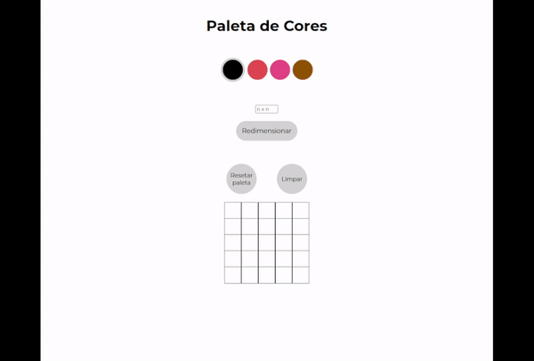

# Pixels Art

Essa é uma aplicação que implementa um editor de artes pixeladas, que possibilita a escolha de cores em uma paleta para pintar um quadro em branco.

O foco desse projeto foi explorar a manipulação de elementos DOM e os escutadores de eventos.

[Experimente!](https://lzaghi.github.io/pixels-art/)

## Funcionalidades

- Geração de uma paleta inicial aleatória
- Possibilidade de resetar a paleta com novas cores aleatórias
- Selecionar cor da paleta
- Usar a cor selecionada para pintar o quadro em branco
- Redimensionar o quadro de pintura
- Limpar o quadro de pintura

## Demonstração




## Tecnologias utilizadas

HTML, CSS, JavaScript, DOM, LocalStorage


## Instalação local

1. Clone o repositório 
```bash
  git clone git@github.com:lzaghi/pixels-art.git
```

2. Entre no diretório 
```bash
  cd pixels-art
```

3. Instale as dependências 
```bash
  npm install
```
4. Inicie a aplicação com a extensão Live Server do VSCode
    

